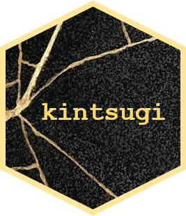

<!-- README.md is generated from README.Rmd. Please edit that file -->

```{r, include = FALSE}
knitr::opts_chunk$set(
  collapse = TRUE,
  comment = "#>",
  fig.path = "man/figures/README-",
  out.width = "100%"
)
```

# kintsugi 

<!-- badges: start -->
<!-- badges: end -->

`kintsugi` is an R package to assist with auditing of data from genetic testing at the North West Genomic Laboratory Hub (GLH) in Manchester. Genetic test information is split between two different databases (DNA Database and iGene) and is also saved in individual .xlsx and .csv files.

`kintsugi` is a project to base genetic data audits around the concept of [Reproducible Analytical Pipelines (RAP)](https://analysisfunction.civilservice.gov.uk/support/reproducible-analytical-pipelines/).

## Installation

You can install the development version of kintsugi from [GitHub](https://github.com/) with:

``` r
# install.packages("pak")
pak::pak("joe-m-shaw/kintsugi")
```

`kintsugi` is intended for internal use only at the North West GLH. 
In order to use `kintsugi`, your computer will need to have an odbc connection to the internal Microsoft SQL server.

## What does kintsugi mean?

Kintsugi is the Japanese art of repairing broken pottery, literally meaning "golden joinery".
The philosophy of kintsugi posits that breaking and rejoining are "part of the history of an object, rather than something to disguise" ([Wikipedia](https://en.wikipedia.org/wiki/Kintsugi)).
This project aims to join data from multiple aspects of genetic testing, without trying to disguise this.

The `kintsugi` logo was made using an image from [this Pinterest account](https://uk.pinterest.com/pin/553590979213079760/).
